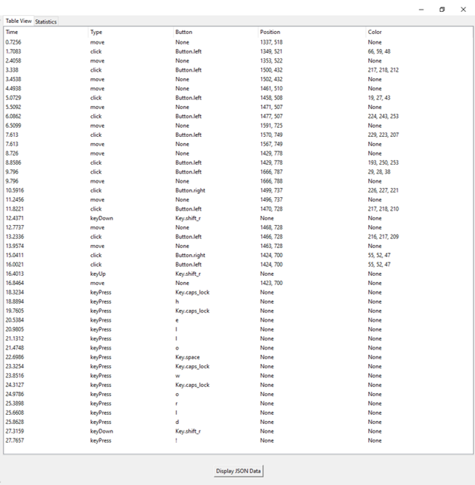
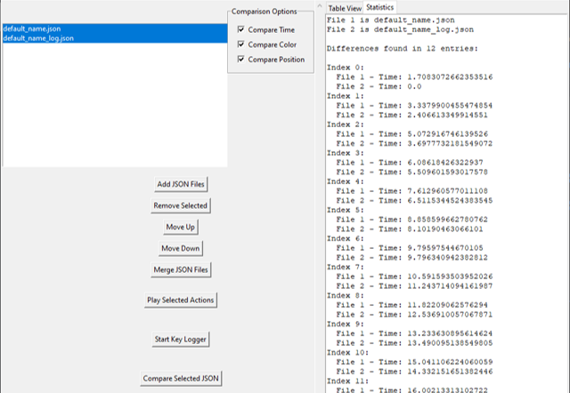

# MMBot Systems

## Overview

This application provides a toolset for automating tasks and analyzing macro recordings. It uses Python libraries like `pyautogui` and `pynput` to record and playback mouse and keyboard actions, and offers a range of analytical features to evaluate the recorded macros.

## Features

### Recording and Playback

- **Record Inputs:** Tracks mouse clicks, movements (with an option to toggle), and keyboard presses.
- **Playback:** Plays back recorded actions and generates logs of the playback process.

### Analytics

- **Time Statistics:** Calculates and displays minimum, maximum, mean, and standard deviation of action timings.
- **Automation Checks:**
  - **Repeated Sequences:** Identifies and counts repeated sequences of actions.
  - **Shannon Entropy:** Measures the predictability of the recorded actions.
  - **Autocorrelation:** Analyzes the autocorrelation of the recorded actions.
- **Clustering:** Performs K-means clustering on coordinates to visualize patterns.

### Comparison

- **Recording vs. Log:** Compares recorded actions with playback logs for discrepancies in time, coordinates, and color.
- **Log vs. Log:** Compares different logs for discrepancies.

### GUI

- **File Management:** Add, remove, sort, and merge JSON files.
- **Display:** View recordings, playback logs, and analytical data in separate tabs.

## Installation

Ensure you have Python installed and then install the required dependencies. You can use `pip` to install the necessary packages:

```bash
pip install pyautogui pynput numpy matplotlib scipy pandas
```

## Usage

### Start the Application:

Run the dashboard.py file to start the GUI.

- Recording:
  Use the provided buttons to record mouse and keyboard actions.
  Playback:

Play back recorded actions and view logs.

- Display and Analyze:

Use the GUI to display recordings, view logs, and perform analysis on the data.

such as - display time statistics

[Min time between actions: 0.050 seconds
Max time between actions: 1.922 seconds
Average time between actions: 0.560 seconds
Standard deviation: 0.549 seconds]
and calculate shannon entropy:
Shannon Entropy of the selected file: 2.369

- Comparison:

Compare recordings with logs for discrepancies and analyze patterns.
Known Issues
Windows Focus Issue: Windows may move to the background when selecting parameters.

### Screenshots

Screenshots of the GUI and output screens will be provided to illustrate the application's functionality.

#### Table

- see recorded data via table view display screen
  

- see stat comparison via statistics display screen
  

## License

This application is not for commercial distribution. It is intended for personal use and educational purposes.

## Contributing

For any inquiries or suggestions, please contact.

Contact
For support or questions, please reach out.
